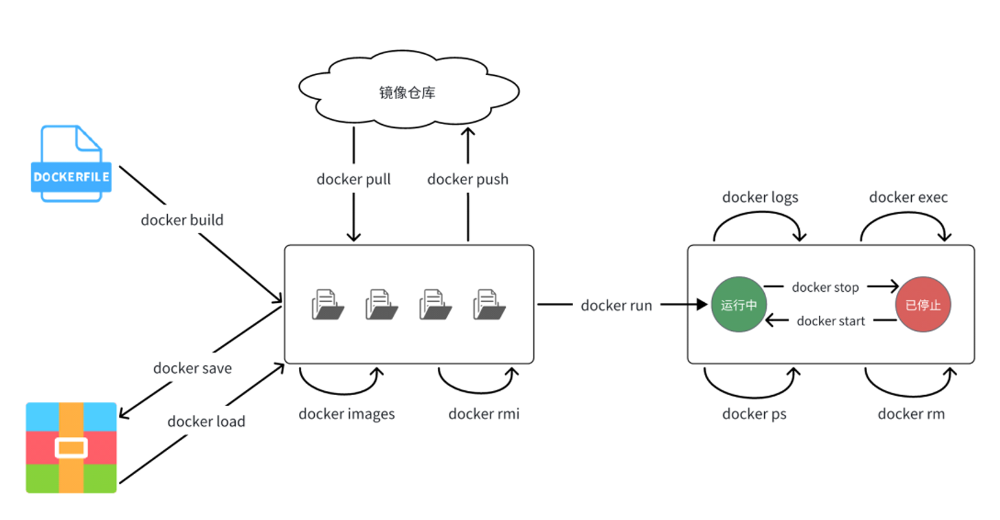
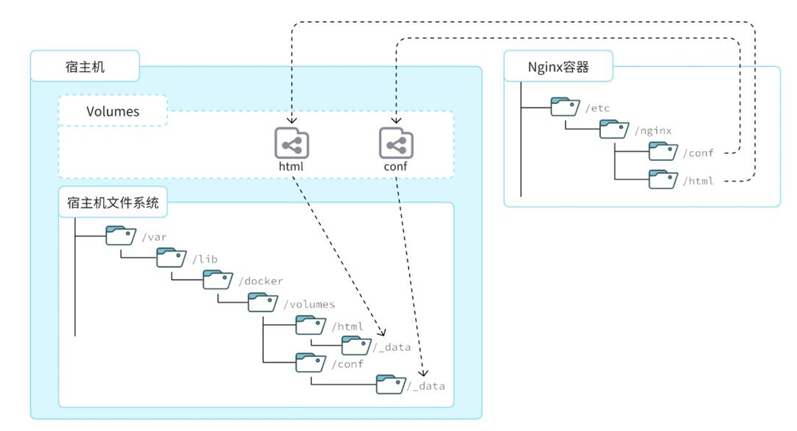

## 1.安装Docker

此处以Ubuntu22.04系统举例

参考官方文档：[个性 | Docker 文档 --- Ubuntu | Docker Docs](https://docs.docker.com/engine/install/ubuntu/)

### 卸载旧版本

安装Docker之前，如果你已经安装了旧版本或非官方版本的Docker，请先卸载

要卸载的非官方软件包是：

- `docker.io`
- `docker-compose`
- `docker-compose-v2`
- `docker-doc`
- `podman-docker`

运行如下指令来卸载冲突的软件包
``` bash
for pkg in docker.io docker-doc docker-compose docker-compose-v2 podman-docker containerd runc; do sudo apt-get remove $pkg; done
```

### 安装

使用如下命令安装最新版Docker

```
# step 1: 安装必要的一些系统工具
apt update
apt -y install apt-transport-https ca-certificates curl software-properties-common
# step 2: 安装GPG证书
curl -fsSL https://mirrors.aliyun.com/docker-ce/linux/ubuntu/gpg | gpg --dearmor > /etc/apt/trusted.gpg.d/docker.gpg
# Step 3: 写入软件源信息
echo "y" | add-apt-repository "deb [arch=amd64] https://mirrors.aliyun.com/docker-ce/linux/ubuntu $(lsb_release -cs) stable"
# Step 4: 更新并安装Docker-CE
apt update && apt install -y docker-ce
systemctl enable docker --now docker
# Step 5: 配置镜像源，此处使用1ms和轩辕，具体详情可以直接查看两个网站
mkdir -p /etc/docker
tee /etc/docker/daemon.json <<EOF
{
"registry-mirrors": [
"https://docker.1ms.run",
"https://docker.xuanyuan.me"
]
}
EOF
systemctl daemon-reload
systemctl restart docker
```

## 2.Docker操作

### 基础命令


| 命令                                   | 作用                  |
| ------------------------------------ | ------------------- |
| docker pull image:version            | 拉取镜像                |
| docker push                          | 推送镜像到DockerRegistry |
| docker images                        | 查看本地镜像              |
| docker rmi image                     | 删除本地镜像              |
| docker run image                     | 创建并运行容器（不能重复创建）     |
| docker create image                  | 只创建但不运行             |
| docker stop container                | 优雅停止容器              |
| docker start container               | 启动容器                |
| docker restart container             | 重启容器                |
| docker rm container                  | 删除容器                |
| docker logs                          | 查看容器运行日志            |
| docker ps                            | 查看(运行中)容器           |
| docker exec -it  container /bin/bash | 以交互式命令行方式进入容器       |
| docker save                          | 保存镜像到本地压缩文件         |
| docker load                          | 加载本地压缩文件到镜像         |
| docker inspect image                 | 查看容器详细信息            |

docker run拥有许多参数：
+ -d，后台运行
+ -it，交互式终端
+ --name，指定容器名称
+ -p，端口映射
 + -v，挂载卷
+ -e，环境变量
+ -rm，容器停止后自动删除

这些参数使得我们可以在创建并运行容器时做许多方便的设置，主要是挂载卷，设置端口映射，环境变量，也有的特殊容器需要停止后自动删除。

默认Docker并不会开机自启，但我们在上面安装时已经设置了，此处表明设置重启的代码，还有设置容器开机自启的代码

``` bash
#Docker开机自启
systemctl enable docker
#容器开机自启
docker update --restart=always [容器]
```

docker各个基础命令之间的关系如图：



## 3.数据卷

数据卷是Docker用于数据持久化和共享的重要机制，它允许容器之间共享数据，并在容器生命周期之外保持数据的持久性。

数据卷实际上就是一个虚拟目录，在容器和宿主机之间建立映射，通过这层映射关系，容器的一些重要数据可以保存在宿主机中，而不会随容器的删除而消失，从而实现了数据持久化。各个容器也可以通过映射到宿主机的同一个目录来共享文件。

看图说话环节：



数据卷相关命令：（标注文档地址供查看命令的详细内容）

| 命令                    | 说明         | 文档                                                                                                   |
| --------------------- | ---------- | ---------------------------------------------------------------------------------------------------- |
| docker volume create  | 创建数据卷      | [docker volume create \| Docker Docs](https://docs.docker.com/reference/cli/docker/volume/create/)   |
| docker volume ls      | 查看所有数据卷    | [docker volume ls \| Docker Docs](https://docs.docker.com/reference/cli/docker/volume/ls/)           |
| docker volume rm      | 删除指定数据卷    | [docker volume prune \| Docker Docs](https://docs.docker.com/reference/cli/docker/volume/prune/)     |
| docker volume inspect | 查看某个数据卷的详情 | [docker volume inspect \| Docker Docs](https://docs.docker.com/reference/cli/docker/volume/inspect/) |
| docker volume prune   | 清除数据卷      | [docker volume ls \| Docker Docs](https://docs.docker.com/reference/cli/docker/volume/ls/)           |

注意：对于已经创建好的容器是不能设置数据卷的，也就是说要在创建容器时配置容器的数据卷挂载（docker run -v）。如果创建容器时没有设置的话数据卷会自动创建

#### 案例：挂载nginx的html目录

比如部署一个网站时，我们需要创建nginx容器，同时将html目录挂载到宿主机来获取静态网页

1.首先创建容器并指定数据卷

`docker run -d --name nginx -p 80:80 -v html:/usr/share/nginx/html nginx`

稍微解释一下各项参数：
+ --name：指定容器名称
+ -p：端口映射，主机：容器
+ -v：挂载数据卷，创建一个名为html的数据卷，并将其挂载到容器内的/usr/share/nginx/html目录下
+ nginx：指定镜像

2.查看数据卷

``` bash
docker volume ls
#返回结果
DRIVER    VOLUME NAME
local     html
```

3.查看数据卷详情

``` bash
docker volume inspect html

[
    {
        "CreatedAt": "2025-08-24T07:57:42Z",
        "Driver": "local",
        "Labels": null,
        "Mountpoint": "/var/lib/docker/volumes/html/_data",
        "Name": "html",
        "Options": null,
        "Scope": "local"
    }
]
```

4.查看/var/lib/docker/volumes/html/\_data目录

``` bash
ll /var/lib/docker/volumes/html/_data
total 16
drwxr-xr-x 2 root root 4096 Aug 24 07:57 ./
drwx-----x 3 root root 4096 Aug 24 07:57 ../
-rw-r--r-- 1 root root  497 Aug 13 14:33 50x.html
-rw-r--r-- 1 root root  615 Aug 13 14:33 index.html
```

5.进入目录，修改index.html内容

``` bash
cd /var/lib/docker/volumes/html/_data 
vim index.html
```

6.打开页面，查看效果

7.进入容器内部，查看/usr/share/nginx/html内的文件是否变化（应该变成上面修改的样子）

`docker exec -it nginx /bin/bash`

#### 匿名数据卷

创建容器时未设置数据卷名，就会自动生成一串hash值填在name处

``` bash
#删除之前的，重新创建nginx容器，但是不指定数据卷名
root@test:~# docker run -d --name nginx -p 80:80 -v /usr/share/nginx/html nginx
351ffd8b64e41edb7dbeec2bea00eba92d4d50ad510790850f93c9551995be8c
root@test:~# docker volume ls
#可以看到数据卷名是一串自动生成的hash
DRIVER    VOLUME NAME
local     afb67111577fea6e5a47c12be22b700d5299a8e09830ad7bd320fc95aed6b51f
#查看容器详细信息，其中的mounts部分
docker inspect nginx
"Mounts": [
            {
                "Type": "volume",
                "Name": "afb67111577fea6e5a47c12be22b700d5299a8e09830ad7bd320fc95aed6b51f",
                "Source": "/var/lib/docker/volumes/afb67111577fea6e5a47c12be22b700d5299a8e09830ad7bd320fc95aed6b51f/_data",
                "Destination": "/usr/share/nginx/html",
                "Driver": "local",
                "Mode": "",
                "RW": true,
                "Propagation": ""
            }
        ],
```

其中有一些多出来的字段，在这里解释一下：
+ Source：宿主机目录
+ Destination：容器内的目录

#### 本地挂载

因为数据卷的目录一般比较深，操作起来不方便，所以我们可以直接将容器目录与宿主机的指定目录挂载。

```
#挂载本地目录
-v 本地目录:容器内目录
#挂载本地文件
-v 本地文件:容器内文件
```

需要注意的是，本地目录或文件必须以/或./开头，如果直接以名字开头，会被识别为数据卷名而不是本地目录名

例：
```
-v mysql:/var/lib/mysql  #mysql会被识别为数据卷名，运行时自动创建这个数据卷
-v ./mysql:/var/lib/mysql #这种才对，会被识别为当前目录下的mysql目录，如果没有的话会自动创建目录。
```

## 4.镜像